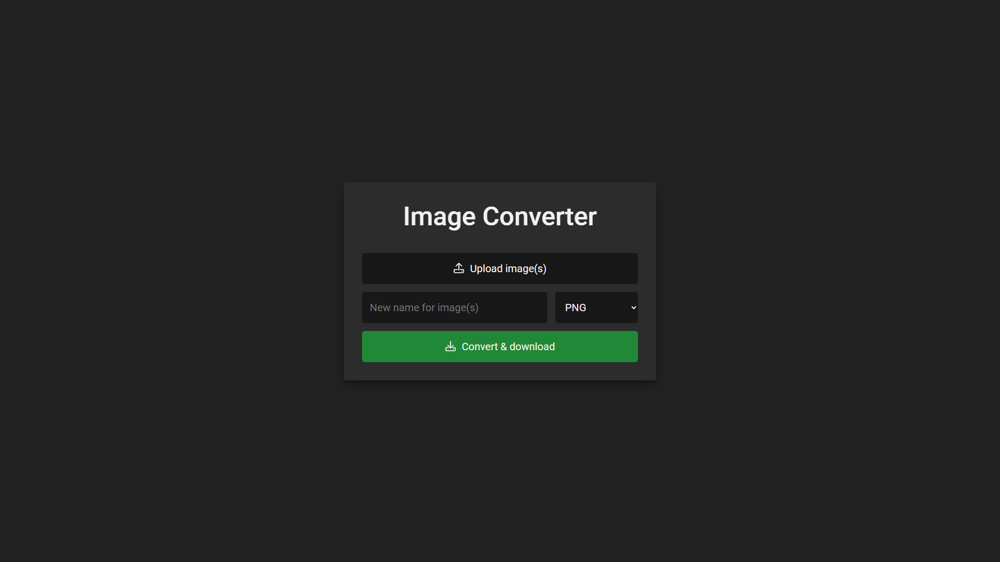
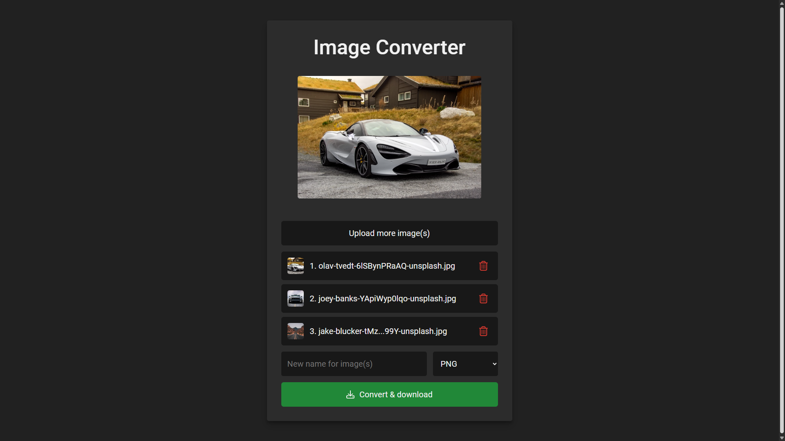

# Image Converter

Live demo: https://www.kristianbenko.com/ImageConverter

## What is this project?

This is a simple, practical web-based image converter that allows users to upload one or multiple images and convert them to a different format (PNG, JPG/JPEG, or WEBP) directly in the browser. The focus is on usability and speed, not on fancy UI or animations (yet!).



## Why did I build it?

I often found myself needing to quickly convert images between formats without installing extra software or uploading files to third-party sites. This project solves that problem by providing a fast, local, and privacy-friendly solution. It’s also a great way to demonstrate my ability to build practical tools with clean, maintainable code.

## Technologies and Tools Used

- **HTML5** for the structure
- **CSS** for basic styling
- **Vanilla JavaScript** for all logic and interactivity
- My own utility library (`general.js`) for common DOM and event handling tasks
- No frameworks or build tools – just pure web tech

## How does it work? (with code examples)

### Uploading Images

Users can upload images by clicking a button or dragging and dropping files. The code below shows how the app listens for file input changes and drag-and-drop events:

```js
listener.add(index.imageInputButton, 'click', () => {
    index.inputImage.click();
});

listener.add(index.inputImage, 'change', () => {
    const files = Array.from(index.inputImage.files).filter(file => index.isValidImageType(file.type));
    if (files.length > 0) {
        index.imageInputButton.textContent = 'Upload more image(s)';
        index.imageQueue = index.imageQueue.concat(files);
        index.updateQueue();
        index.startSlideshow();
        const reader = new FileReader();
        listener.add(reader, 'load', (e) => {
            index.imgPreview.src = e.target.result;
            index.imgPreview.style.display = 'block';
        });
        reader.readAsDataURL(files[0]);
    }
});
```

### Drag & Drop Support

```js
listener.add(document.body, 'drop', (e) => {
    e.preventDefault();
    index.dragOverlay.style.display = 'none';
    const files = e.dataTransfer.files;
    if (files && files.length > 0) {
        const validFiles = Array.from(files).filter(file => index.isValidImageType(file.type));
        if (validFiles.length > 0) {
            index.imageInputButton.textContent = 'Upload more image(s)';
            index.imageQueue = index.imageQueue.concat(validFiles);
            index.updateQueue();
            index.startSlideshow();
            const reader = new FileReader();
            listener.add(reader, 'load', (e) => {
                index.imgPreview.src = e.target.result;
                index.imgPreview.style.display = 'block';
            });
            reader.readAsDataURL(validFiles[0]);
        } else {
            alert('Please drop valid PNG, JPG/JPEG or WEBP image files only.');
        }
    }
});
```

### Image Queue and Preview

Uploaded images are shown in a queue, and the first image is previewed. Hovering over a queue item shows a preview, and there’s a simple slideshow for multiple images:

```js
updateQueue() {
    index.queue.innerHTML = '';
    if (index.imageQueue.length > 0) {
        index.queue.style.display = 'flex';
    } else {
        index.queue.style.display = 'none';
    }
    index.imageQueue.forEach((file, i) => {
        // ...
        let el = strToEl(`
            <div class="queueItem">
                <div class="thumbnail"></div>
                <div class="name" title="${file.name}">
                    <span>${i + 1}. ${filename}</span>
                </div>
                <button title="Remove from queue">
                    <i class="fa-regular fa-trash-can"></i>
                </button>
            </div>
        `);
        // ...
    });
}
```



### Converting and Downloading Images

When the user clicks the convert button, each image is drawn to a canvas and re-encoded in the selected format. The result is automatically downloaded:

```js
convertAllImages() {
    const format = index.format.value;
    const nameBase = index.nameInput.value.trim() || 'ConvertedImage';
    index.imageQueue.forEach((file, idx) => {
        const img = new Image();
        listener.add(img, 'load', () => {
            const canvas = document.createElement('canvas');
            canvas.width = img.width;
            canvas.height = img.height;
            const ctx = canvas.getContext('2d');
            ctx.drawImage(img, 0, 0);
            let mime = 'image/' + format;
            let extension = format;
            if (format === 'jpeg') mime = 'image/jpeg';
            canvas.toBlob(blob => {
                if (!blob) return;
                const url = URL.createObjectURL(blob);
                const a = document.createElement('a');
                a.href = url;
                a.download = `${nameBase}_${idx + 1}.${extension}`;
                document.body.appendChild(a);
                a.click();
                setTimeout(() => {
                    document.body.removeChild(a);
                    URL.revokeObjectURL(url);
                }, 100);
            }, mime, 1.0);
        });
        listener.add(img, 'error', () => {
            alert(`Error: The image with ID ${idx + 1} is invalid.`);
        });
        img.src = URL.createObjectURL(file);
    });
}
```

### Utility Library: `general.js`

I use my own utility library for common tasks. For example, here’s a function to extract file extensions:

```js
function getExtension(string) {
    let extensions = ['jpg', 'png', 'webp', 'jpeg', 'tif', 'tiff', 'bmp', 'gif', 'svg', 'ico', 'mp4'];
    for (let extension of extensions) {
        if (string.includes(`.${extension}`)) {
            return extension;
        } else if (string.includes(`.${extension.toUpperCase()}`)) {
            return extension.toUpperCase();
        }
    }
}
```

And a robust event listener utility:

```js
const listener = {
    functions: {},
    add(arg1, arg2, arg3, arg4) {
        // ...existing code...
    }
    // ...existing code...
}
```

## What have I learned?

This project reinforced the value of focusing on usability and core functionality first. I also got to practice working with the File API, drag-and-drop, and canvas manipulation in vanilla JavaScript. There’s plenty of room for UI/UX improvements, but the core logic is robust and extendable.

If you’d like to know more about the project, feel free to reach out!
